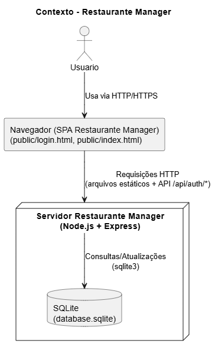
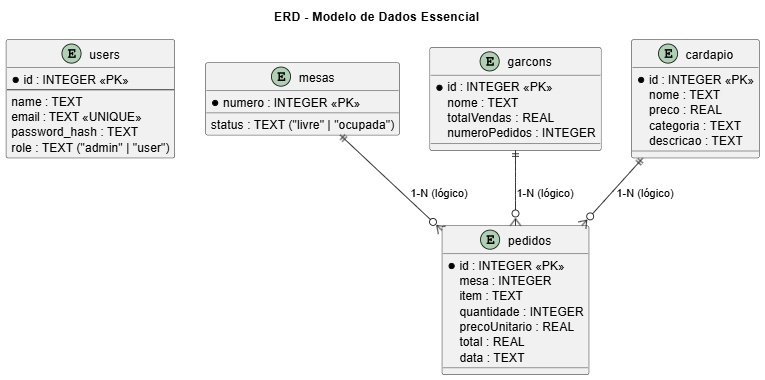
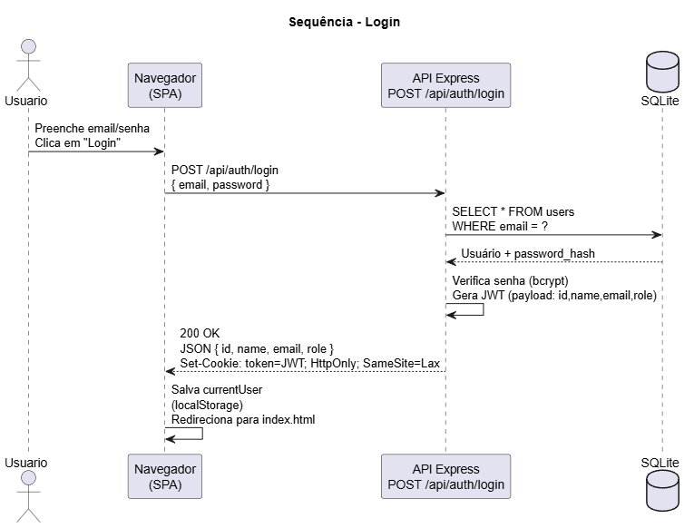
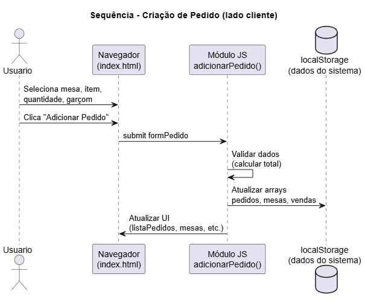

# Restaurante Manager

Sistema simples de gerenciamento de restaurante, com foco em fluxo de pedidos em mesas e controle básico de usuários com níveis de acesso.  
A aplicação é composta por um backend em Node.js/Express com autenticação JWT via cookie e um frontend SPA (Single Page Application) em HTML/CSS/JS servido pela própria API. O banco de dados é SQLite, inicializado automaticamente com um usuário administrador padrão.

## Arquitetura

- **Frontend**: páginas estáticas em `public/` (`login.html` e `index.html`) com JavaScript vanilla para navegação entre seções (pedidos, mesas, cardápio, estoque, garçons e usuários) e controle de interface por `role` (admin / user).
- **Backend**: servidor Express (`server.js`) que expõe endpoints de autenticação (`/api/auth/*`) e serve os arquivos estáticos; usa JWT armazenado em cookie HTTP‑only e middlewares `requireAuth` e `requireAdmin` para proteger as rotas.
- **Banco de dados**: SQLite (`database.sqlite`), inicializado em `db.js`, com tabela `users` e um usuário admin padrão (`admin@local / admin123`).

---

## Como executar o projeto

### 1. Clonar o repositório

git clone https://github.com/seu-usuario/seu-repo.git
cd seu-repo

### 2. Instalar dependências

npm install

### 3. Configurar variáveis de ambiente

Crie um arquivo `.env` na raiz a partir de `.env.example`:

cp .env.example .env

Exemplo de conteúdo:

PORT=3000
JWT_SECRET=changeme-super-secret

- `PORT`: porta em que o servidor Express irá rodar (padrão: 3000).
- `JWT_SECRET`: segredo usado para assinar os tokens JWT.

### 4. Inicializar o banco

Nenhuma migration manual é necessária:  
- Ao subir o servidor, `db.js` cria automaticamente a tabela `users` (se não existir).  
- Também cria um usuário admin padrão: `admin@local` com senha `admin123`.

### 5. Rodar o servidor

npm start

ou
node server.js

Por padrão, a aplicação ficará disponível em:

- http://localhost:3000/login.html → tela de login  
- http://localhost:3000/index.html → tela principal (SPA) – protegida, redireciona para login se não autenticado

---

## Variáveis de ambiente (.env.example)

Crie um arquivo `./.env.example` com:

PORT=3000
JWT_SECRET=um_segredo_muito_seguros123

---

## Usuários de teste e fluxos para demonstração

### Usuário administrador

- **Login**: `admin@local`  
- **Senha**: `admin123`  

Criado automaticamente em `db.js` se ainda não existir.

**Fluxos para demonstrar com admin:**

- Login na tela `login.html` e redirecionamento para `index.html`.
- Cadastro de novo usuário (aba “Usuários”), incluindo usuário comum (`role = user`).
- Cadastro de pratos no cardápio, alteração de preço e remoção.
- Cadastro de garçons.
- Adição de itens ao estoque.
- Criação de pedidos escolhendo mesa, prato e garçom.

### Usuário comum

- Criar com o admin na aba “Usuários” (ex.: `garcom1@local / senha123`, role `user`).

**Fluxos para demonstrar com user:**

- Login com usuário comum.
- Visualizar mesas, cardápio, estoque e garçons.
- Criar pedidos (selecionar mesa, prato e garçom já existentes).
- Ver que **não aparecem**:
  - Aba/Seção de cadastro de usuários.
  - Cartão “Cadastrar Garçom”.
  - Cartão “Adicionar Item ao Cardápio”.
  - Cartão “Adicionar Item ao Estoque”.
  - Botões de “Editar/Remover” itens do cardápio/garçons/estoque.

---

## API – principais endpoints

Todos os endpoints abaixo estão versionados sob `/api/auth` e usam JSON.

| Método | Rota               | Descrição                                       | Auth / Role           |
|-------|--------------------|-------------------------------------------------|-----------------------|
| POST  | `/api/auth/login`  | Autentica usuário, retorna dados e seta cookie `token` | Público               |
| POST  | `/api/auth/logout` | Limpa cookie de autenticação                    | Autenticado           |
| POST  | `/api/auth/register` | Cria novo usuário (name, email, password, role) | Autenticado + Admin   |
| GET   | `/api/auth/users`  | Lista usuários (id, name, email, role)          | Autenticado + Admin   |

- Autenticação é feita via cookie HTTP‑only (`token`) com JWT assinado usando `JWT_SECRET`.
- `requireAuth` garante que o usuário esteja autenticado.
- `requireAdmin` garante que `req.user.role === 'admin'`.

---

## Arquitetura / System Design

Na pasta `/docs/system-design` (a criar), incluir:

- `context.*` – diagrama de contexto (Usuário → Navegador → API Express → SQLite).
- `containers.*` – diagrama de containers (Frontend SPA, Auth Service, Restaurant Service, DB).
- `erd.*` – diagrama ERD lógico (Users, Mesas, Pedidos, Cardápio, Garçons).
- `sequence-login.*` – diagrama de sequência do fluxo de login.
- `sequence-pedido.*` – diagrama de sequência do fluxo de criação de pedido.

Coloque, por exemplo, arquivos PNG/SVG gerados em qualquer ferramenta (draw.io, Excalidraw, etc.) e referencie-os aqui:

### Contexto

### Containers

### ERD

### Sequência - Login

### Sequência - Pedido

---
